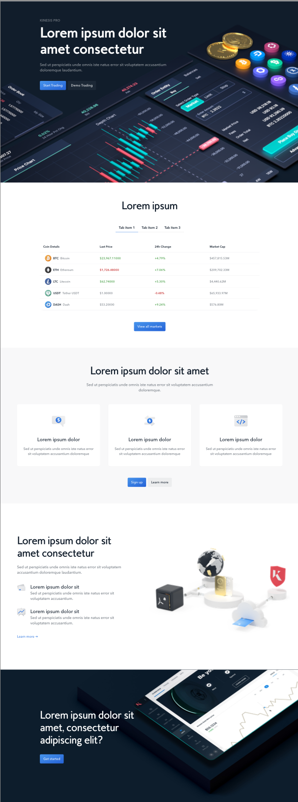

# wordpress-technical-test
This is the Repo for the Wordpress Technical Test

# Quick Links
1. [Test brief](#test-brief)
2. [Requirments](#requirements)
4. [Pricing table](#pricing-table)
5. [Design](#design)
6. [Assets](#assets)

# Test Brief
The purpose of this test is for us to see what kind of developer you are. 

The task is simple, follow instructions where required and show initiative where you can. 

This test shouldn’t take more than a couple of hours. 

It will require varied frontend and backend skills.

TLDR; convert the following design into a wordpress page.

# Requirements
The task is to create this page in wordpress using a custom built plugin to generate the blocks for the page. You can rely on the use of other plugins if necessary.

Each section of this page should be built as a block allowing them to be moved around the page without breaking and allow for multiple instances of the blocks on the same page.

The page should be fully responsive, the responsive design has not been provided please use best judgement.

# Pricing Table
The pricing table shown in the design should pull through dynamic content. To do this you can use a free CoinMarketCap api. 

https://coinmarketcap.com/api/. You can use any API for this as long as it provides all data shown in the design.

# Design
The design can be found here. https://www.figma.com/file/PuLjccv9evn1GTTHrsDKvu/Dev-tech-test?type=design&node-id=1-8702&mode=design&t=fU8P48P5jqDeUxyv-0

If you haven't already, sign up for a free Figma account, so you can work with the design.
*(You may only need to do this if you are unable to view the design straight away)*.

# Assets
All image and icon assets can be found in the assets folder:

https://github.com/bullioncapital/wordpress-technical-test/tree/main/assets
